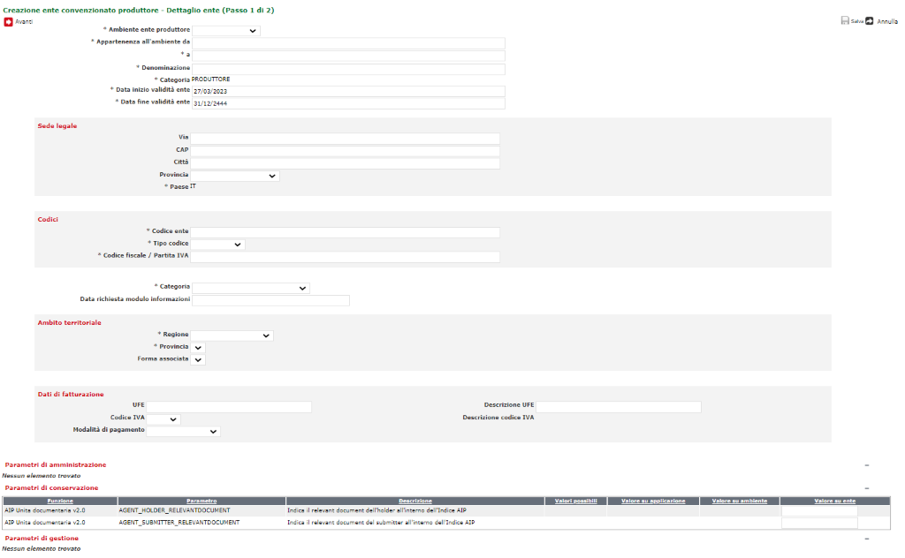

# SIAM (SACER Identity and Access Management) 

Fonte template redazione documento:  https://www.makeareadme.com/.


# Descrizione

SIAM (SACER Identity and Access Management) è il modulo del Sistema di Conservazione SACER che si occupa della gestione dell'autenticazione e profilazione degli utenti e degli enti cui appartengono.

Tramite la possibilità  di definire specifici ruoli e di combinarli tra loro, l'utente può essere profilato alle singole attività previste dal Sistema (p.e. pressione di uno specifico bottone di una specifica videata) e ad ogni livello dei dati gestiti.   

SIAM gestisce l'autenticazione tramite standard SAML utilizzando un Idp esterno e consente agli utenti del Sistema di autenticarsi anche attraverso SPID..   

SIAM consente di gestire l'anagrafe degli enti che utilizzano il sistema di conservazione e dei loro rapporti formali (accordi) con l'ente conservatore. 


# Installazione

Requisiti minimi per installazione: 

- Sistema operativo : consigliato Linux server (in alternativa compatibilità con Windows server);
- Java versione 8 (OpenJDK / Oracle);
- JBoss 7 EAP;
- Oracle DB (versione consigliata 19c).

## Instalazione JDK 

Consigliata adozione della OpenJDK alla versione 8, guida all'installazione https://openjdk.org/install/.

## Setup application server (Jboss 7)

Richiesta l'esecuzione delle seguenti guide secondo l'ordine riportato di seguito: 

1. guida per la configurazione **base** di [guida 1](src/docs/JBoss7_configurazione_generale.md);
2. guida con le configurazioni **specifiche** per il contesto applicativo **SIAM**  di [guida 2](src/docs/JBoss7_configurazione_siam.md).

### Deploy su JBoss 7

Di seguito le indicazioni per il rilascio su application server JBoss7: 

1. generazione dell'artifact attraverso tool maven, eseguire il seguente comando: 

   ```bash
   mvn package
   ```
   
2. viene generato l'artifact .ear all'interno del modulo SacerIam-ear/target (e.g. saceriam-4.18.0.ear)
3. deploy dell'ear generato allo step 1 su JBoss 7 (vedi configurazione [setup JBoss7](#setup-application-server-jboss-7))


## Predisposizione database

L'applicazione utilizza come DBMS di riferimento Oracle DB (https://www.oracle.com/it/database/) alla versione, consigliata, **19c**. Per l'installazione e la configurazione fare riferimento alle guide ufficiali.

Per la creazione del modello E-R consultare il seguente [README.md](https://github.com/RegioneER/parer-db-init/blob/master/README.md) (progetto di riferimento https://github.com/RegioneER/parer-db-init).


# Utilizzo

Di seguito la descrizione delle principali funzionalità.
 
## Amministrazione Utenti 
   
 


Gli utenti possono essere di due tipi: persona fisica o automa. La loro creazione e successiva gestione deve essere preceduta da una specifica richiesta da parte del proprio ente di appartenenza in cui viene indicato il grado richiesto di operatività sui dati e sul sistema. L'operatività è definita con un ruolo o una combinazione di ruoli che possono essere attribuiti all'utente. 
 
  
## Amministrazione Enti
  
 

  
### Enti convenzionati 
 
Sono enti convenzionati tutti gli enti che conservano utilizzando il Sistema a seguito della stipula di una convenzione o di un accordo. 
Gli enti si suddividono in:  

- CONSERVATORI: svolgono la funzione di conservazione per sé e per gli enti produttori; 
- GESTORI: supportano gli enti produttori nei rapporti con il conservatore;  
- PRODUTTORI: utilizzano il sistema per conservare i propri documenti e archivi.
  

 
  
### Enti non convenzionati 

L'anagrafe degli enti non convenzionati è costituita da: 
- fornitori esterni: aziende che supportano gli enti convenzionati nell'interfacciamento dei sistemi di gestione documentale e nel monitoraggio dei versamenti; 
- organi di vigilanza: le Soprintendenze Archivistiche con le quali il conservatore definisce accordi per l'accesso al sistema a scopo di vigilanza. 

   
 

### Gestione collegamenti 

Siam permette di individuare collegamenti tra gli Enti per consentire politiche comuni di accesso agli archivi degli enti collegati 
I collegamenti che si possono creare sono di due tipi:  

- GERARCHICI: quando esiste un legame gerarchico tra gli enti collegati. Un esempio è rappresentato dalle unioni di comuni in cui esiste un ente capofila che è l'ente unione;
- RETICOLARI: quando non esiste una gerarchia tra gli enti collegati che sono tutti allo stesso livello tra loro. 
  
### Gestione accordi 

L'accordo/convenzione contiene le informazioni relative a decorrenze, scadenze, servizi erogati. 


# Librerie utilizzate

|  GroupId | ArtifactId  | Version  | Type   |  Licenses |
|---|---|---|---|---|
|commons-beanutils|commons-beanutils|1.9.4|jar|Apache License, Version 2.0|
|commons-codec|commons-codec|1.15.0.redhat-00001|jar|Apache License, Version 2.0|
|commons-collections|commons-collections|3.2.2|jar|Apache License, Version 2.0|
|commons-fileupload|commons-fileupload|1.5|jar|Apache-2.0|
|commons-io|commons-io|2.12.0|jar|Apache-2.0|
|it.eng.parer|saceriam-jboss-ejb|4.18.0|ejb|-|
|it.eng.parer|saceriam-jboss-jpa|4.18.0|jar|-|
|it.eng.parer|saceriam-jboss-slg|4.18.0|jar|-|
|it.eng.parer|saceriam-jboss-web|4.18.0|war|-|
|it.eng.parer|spagofat-core|4.11.0|jar|-|
|it.eng.parer|spagofat-middle|4.11.0|jar|-|
|it.eng.parer|spagofat-paginator-ejb|4.11.0|ejb|-|
|it.eng.parer|spagofat-sl-ejb|4.11.0|ejb|-|
|it.eng.parer|spagofat-sl-slg|4.11.0|jar|-|
|org.springframework.security.extensions|spring-security-saml2-core|1.0.10.RELEASE|jar|The Apache Software License, Version 2.0|
|xalan|xalan|2.7.2|jar|The Apache Software License, Version 2.0|
|xml-resolver|xml-resolver|1.2.0.redhat-10|jar|The Apache Software License, Version 2.0|
|antlr|antlr|2.7.7.redhat-7|jar|BSD License|
|aopalliance|aopalliance|1.0|jar|Public Domain|
||com.fasterxml|classmate|1.5.1.redhat-00001|jar|Apache License, Version 2.0|
|com.fasterxml.jackson.core|jackson-annotations|2.12.7.redhat-00003|jar|The Apache Software License, Version 2.0|
|com.fasterxml.jackson.core|jackson-core|2.12.7.redhat-00003|jar|The Apache Software License, Version 2.0|
|com.fasterxml.jackson.core|jackson-databind|2.12.7.redhat-00003|jar|The Apache Software License, Version 2.0|
|com.io7m.xom|xom|1.2.10|jar|The GNU Lesser General Public License, Version 2.1|
|com.narupley|not-going-to-be-commons-ssl|0.3.20|jar|The Apache License, Version 2.0|
|com.sun.activation|jakarta.activation|1.2.2.redhat-00001|jar|EDL 1.0|
|com.sun.istack|istack-commons-runtime|3.0.10.redhat-00001|jar|Eclipse Distribution License - v 1.0|
|com.zaxxer|SparseBitSet|1.2|jar|The Apache Software License, Version 2.0|
|commons-httpclient|commons-httpclient|3.1|jar|-|
|commons-logging|commons-logging|1.2|jar|The Apache Software License, Version 2.0|
|commons-net|commons-net|3.9.0|jar|Apache License, Version 2.0|
|it.eng.parer|idp-jaas-rdbms|0.0.9|jar|-|
|it.eng.parer|spagofat-paginator-gf|4.11.0|jar|-|
|it.eng.parer|spagofat-si-client|4.11.0|jar|-|
|it.eng.parer|spagofat-si-util|4.11.0|jar|-|
|it.eng.parer|spagofat-sl-jpa|4.11.0|jar|-|
|it.eng.parer|spagofat-timer-wrapper-common|4.11.0|jar|-|
|it.eng.parer|spagofat-timer-wrapper-ejb|4.11.0|ejb|-|
|jakarta.xml.bind|jakarta.xml.bind-api|2.3.2|jar|Eclipse Distribution License - v 1.0|
|joda-time|joda-time|2.12.5|jar|Apache License, Version 2.0|
|net.bytebuddy|byte-buddy|1.11.12.redhat-00002|jar|Apache License, Version 2.0|
|net.sourceforge.javacsv|javacsv|2.0|jar|GNU Library or Lesser General Public License|
|org.apache-extras.beanshell|bsh|2.0b6|jar|Apache License, Version 2.0|
|org.apache.commons|commons-collections4|4.4|jar|Apache License, Version 2.0|
|org.apache.commons|commons-lang3|3.8.1|jar|Apache License, Version 2.0|
|org.apache.commons|commons-math3|3.6.1|jar|Apache License, Version 2.0|
|org.apache.commons|commons-text|1.10.0|jar|Apache License, Version 2.0|
|org.apache.httpcomponents|httpclient|4.5.13.redhat-00001|jar|Apache License, Version 2.0|
|org.apache.httpcomponents|httpcore|4.4.14.redhat-00001|jar|Apache License, Version 2.0|
|org.apache.poi|poi|4.1.2|jar|Apache License, Version 2.0|
|org.apache.santuario|xmlsec|2.2.3.redhat-00001|jar|Apache License, Version 2.0|
|org.apache.tika|tika-core|2.8.0|jar|Apache-2.0|
|org.apache.velocity|velocity-engine-core|2.0|jar|Apache License, Version 2.0|
|org.apache.xmlbeans|xmlbeans|3.1.0|jar|The Apache Software License, Version 2.0|
|org.bouncycastle|bcpkix-jdk15on|1.70|jar|Bouncy Castle Licence|
|org.bouncycastle|bcprov-jdk15on|1.70|jar|Bouncy Castle Licence|
|org.bouncycastle|bcutil-jdk15on|1.70|jar|Bouncy Castle Licence|
|org.codehaus.jettison|jettison|1.5.2.redhat-00002|jar|Apache License, Version 2.0|
|org.dom4j|dom4j|2.1.3.redhat-00001|jar|BSD 3-clause New License|
|org.glassfish.jaxb|jaxb-runtime|2.3.3.b02-redhat-00002|jar|Eclipse Distribution License - v 1.0|
|org.glassfish.jaxb|txw2|2.3.3.b02-redhat-00002|jar|Eclipse Distribution License - v 1.0|
|org.hibernate|hibernate-core|5.3.29.Final-redhat-00001|jar|GNU Library General Public License v2.1 or later|
|org.hibernate|hibernate-entitymanager|5.3.29.Final-redhat-00001|jar|GNU Library General Public License v2.1 or later|
|org.hibernate|hibernate-jpamodelgen|5.3.29.Final-redhat-00001|jar|GNU Library General Public License v2.1 or later|
|org.hibernate.common|hibernate-commons-annotations|5.0.5.Final-redhat-00002|jar|GNU Lesser General Public License v2.1 or later|
|org.hibernate.validator|hibernate-validator|6.0.23.Final-redhat-00001|jar|Apache License 2.0|
|org.javassist|javassist|3.27.0.GA-redhat-00001|jar|MPL 1.1LGPL 2.1Apache License 2.0|
|org.jboss|jandex|2.4.2.Final-redhat-00001|jar|Apache License, Version 2.0|
|org.jboss.logging|jboss-logging|3.4.1.Final-redhat-00001|jar|Apache License, version 2.0|
|org.keycloak|keycloak-adapter-core|21.1.1|jar|Apache License, Version 2.0|
|org.keycloak|keycloak-adapter-spi|21.1.1|jar|Apache License, Version 2.0|
|org.keycloak|keycloak-authz-client|21.1.1|jar|Apache License, Version 2.0|
|org.keycloak|keycloak-common|21.1.1|jar|Apache License, Version 2.0|
|org.keycloak|keycloak-core|21.1.1|jar|Apache License, Version 2.0|
|org.keycloak|keycloak-crypto-default|21.1.1|jar|Apache License, Version 2.0|
|org.keycloak|keycloak-policy-enforcer|21.1.1|jar|Apache License, Version 2.0|
|org.keycloak|keycloak-server-spi|21.1.1|jar|Apache License, Version 2.0|
|org.keycloak|keycloak-server-spi-private|21.1.1|jar|Apache License, Version 2.0|
|org.keycloak|keycloak-servlet-adapter-spi|21.1.1|jar|Apache License, Version 2.0|
|org.keycloak|keycloak-servlet-filter-adapter|21.1.1|jar|Apache License, Version 2.0|
|org.opensaml|opensaml|2.6.6|jar|The Apache Software License, Version 2.0|
|org.opensaml|openws|1.5.6|jar|The Apache Software License, Version 2.0|
|org.opensaml|xmltooling|1.4.6|jar|The Apache Software License, Version 2.0|
|org.owasp.esapi|esapi|2.2.0.0|jar|BSDCreative Commons 3.0 BY-SA|
|org.slf4j|slf4j-api|1.7.22.redhat-2|jar|MIT License|
|org.springframework|spring-aop|4.3.30.RELEASE|jar|Apache License, Version 2.0|
|org.springframework|spring-beans|4.3.30.RELEASE|jar|Apache License, Version 2.0|
|org.springframework|spring-context|4.3.30.RELEASE|jar|Apache License, Version 2.0|
|org.springframework|spring-core|4.3.30.RELEASE|jar|Apache License, Version 2.0|
|org.springframework|spring-expression|4.3.30.RELEASE|jar|Apache License, Version 2.0|
|org.springframework|spring-web|4.3.30.RELEASE|jar|Apache License, Version 2.0|
|org.springframework|spring-webmvc|4.3.30.RELEASE|jar|Apache License, Version 2.0|
|org.springframework.security|spring-security-config|4.2.20.RELEASE|jar|The Apache Software License, Version 2.0|
|org.springframework.security|spring-security-core|4.2.20.RELEASE|jar|The Apache Software License, Version 2.0|
|org.springframework.security|spring-security-web|4.2.20.RELEASE|jar|The Apache Software License, Version 2.0|
|xalan|serializer|2.7.2|jar|The Apache Software License, Version 2.0|

# Supporto

Mantainer del progetto è [Engineering Ingegneria Informatica S.p.A.](https://www.eng.it/).

# Contributi

Se interessati a crontribuire alla crescita del progetto potete scrivere all'indirizzo email <a href="mailto:areasviluppoparer@regione.emilia-romagna.it">areasviluppoparer@regione.emilia-romagna.it</a>.

# Credits

Progetto di proprietà di [Regione Emilia-Romagna](https://www.regione.emilia-romagna.it/) sviluppato a cura di [Engineering Ingegneria Informatica S.p.A.](https://www.eng.it/).

# Licenza

Questo progetto è rilasciato sotto licenza GNU Affero General Public License v3.0 or later ([LICENSE.txt](LICENSE.txt)).

# Appendice

## Documentazione aggiuntiva

Alcuni riferimenti:

- Manuale di conservazione: https://poloarchivistico.regione.emilia-romagna.it/documentazione/documenti_open/manualeconservazione_v5-0.pdf/@@download/file/ManualeConservazione_v2.0.pdf 


## JStree vesione 1 vs 3

Fare riferimento a : https://www.jstree.com/api/

<b>Attenzione</b> tie_selection true/false e proplematiche nella gestione degli stati di selezione delle checkbox  

Nota bene : dopo attenta analisi e sperimentazione la configurazione scelta per il plugin "checkbox" al fine di mantenere il comportamento precedente è : tie_selection = false e 
 whole_node  false, laddove sia necessaria la gestione "two_state" della precedente versione è necessario introdurre la three_state = false

* whole_node = false
   * funziona esclusivamente se tie_selection false
* tie_selection = false 
   * gli eventi di chech_node.jstree e uncheck_node.jstree vengono intercentati altrimenti no
   * la function is_checked re-implementata con una function appositamente implementata, che richiama l'apposita api https://www.jstree.com/api/#/?f=is_checked(obj)
* json_data
    * integrato, non esiste un plugin è sufficiente modificare la logica di back-end in modo da restituire un json compliant (vedi buildJSONNode su AmministrazioneRuoliAction
    * vedere inoltre su taglibrary dichiarazione "core / data / uri" per la nuova modalità di integrazione con un modello JSON (vedi core : data + url) 
* check_node 
    * serve prima eseguire il triggering dell'open_all altrimenti non riesce a checkare i nodi selezionati
* get_path 
    * necessario passare il nodo (vedi get_node) https://www.jstree.com/api/#/?f=get_path(obj%20[,%20glue,%20ids])
* metodo lock non esiste 
    * è stata creata apposita function che locka il tree (in sola lettura)
* loaded() 
    * non esiste, è necessario scatenare l'evento loaded.jstree
* populateTreee 
    * è necessario gestire l'hiding/show del tree (come elemnto all'interno del DOM) quando non sono presenti valori selezionati (vedi nome applicazione/azione)
* checkbox two_state 
    * non esiste più, si pone a "false" il three_state 
* get_checked(node) 
    * non esiste più la possibilità di ottenere i soli "figli" selezionati è stata indorotta apposita function
```javascript
function get_selected_children(node) {
    [....]
    return result;
}
```
* è stata modificata la taglibrary JTreeTag in modo tale da gestire delle proprietà legate ai plugin in uso (vedi checkbox : tree_state & altro) questo per fare in modo di pilotare determinate caratteristiche secondo il bisogno, e.g. nel caso dell'abilitazione al menu il three_state NON risulta necessario a differenza invece delle azioni (attenzione che in questo caso è necesssaria la javascript function che gestisce l'interazione in fase di editing)
* non esiste il metodo unlock quindi è necessario creare un'apposita function per rimuovere eventuali lock sul tree

### Ulteriori note

Sono stati osservati dei comportamenti anomali su web application [sacer-iam](https://gitlab.ente.regione.emr.it/parer/sacer-iam) in cui il componente JStree viene utilizzato per la gestione delle autorizzazioni. 

**get_cheked vs get_top_checked**

Il passaggio dalla versione 1 alla 3 di JStree ha portato al cambiamento generale delle API utilizzate in precedenza, nello specifico, un diverso comportamento legato alla API [get_checked](https://www.jstree.com/api/#/?f=get_checked([full])) che nella precedente versione [link](https://old.jstree.com/documentation/checkbox), presentava una diversa logica.<br/>
Se nella logica precedente la lista delle checkbox selezionate poteva riguardare, da un lato tutti i livelli dell'albero (governato da apposito boolean get_all) mentre dall'altro solo i "top level" (utilizzato per l'autorizzazione sui Menu), con la nuova api questo è possibile solo richiamando la API [get_top_checked](https://www.jstree.com/api/#/?f=get_top_checked([full])).<br/> Per esibire lo stesso comportamento e relativa logica, della precedente versione dell'applicativo con JStree v.1, si è dovuto differenziare per Menu e Azioni la selezione degli IDs (lista) delle checkbox selezionate, per cui le azioni utilizzano la get_checked mentre i menu la get_top_checked.


**popolamento JStree albero Azioni e refreshing**

Altra importante osservazione del comportamento precedente, ossia con JStree v.1, è legato al **primo** caricamento dei due alberi (Menu vs Azioni), e nello specifico, ad una problematica importante in fase di persistenza, delle modifiche effettuate sull'albero delle azioni. <br/>Sulla modifica del ruolo attraverso una logica di chiamate ad enpoint REST esposti sul relativo controller, si effettuano i popolamenti degli elementi presenti sull'alberto attraverso un evento di "check" (o selezione) del singolo nodo in cui inoltre vengono aggiunti degli attributi "custom" sotto forma di identificati (id_rich_autor / id_page_autor) resituiti dal JSON, risposta alla chiamata sul banck-end effettuata in precedenza. <br/>La selezione degli elementi checkbox su albero scatena il triggering dell'evento "check_node.jstree" il quale viene intercettato da logiche presenti sul client e, proprio su tali logiche, si è dovuti intervenire (vedi variabile "refreshing" su pagina) per evitare che, alla selezionata di una foglia dovendo selezionare anche il padre, si torni a scatenare il medesimo evento, togliendo quindi il controllo alla function "checkData", invocata in fase di popolamento. Il parametro "refreshing" interviene, appunto, come "driver" di gestione del diverso comportamento, dal primo popalmento con JSON a tutte le fasi successive di selezione dei vari nodi e relative logiche collegate.

**trigger evento check_node.jstree**

In JStree v.1 tutte le volte che veniva chiamata 
```js
tree.jstree('check_node', node);
```
 si scatenava l'evento "check_node.jstree", mentre nella versione 3 l'evento viene scatenato solo se il nodo non risulta già checked. 
Poiché durante il popolamento della struttura dell'albero possono esserci check multilpli sullo stesso nodo nell'upgrade della libreria si ha un cambio del comportamento proprio per la mancata chiamata dell'evento check_node.jstree.
Per emulare il comportamento della versione 1 bisogna quindi fare l'uncheck del nodo prima di fare nuovamente la check.
Per evitare che questo triggeri anche l'evento di uncheck, con risvolti non predicibili, è stato introdotto un attributo custom sull'albero, "skip_event". 
La logica descritta è stata incapsulata nella funzione
```js
function check_node_force_event(idTree,idNode)
```
ed è stato aggiunto un controllo nella funzione dell'evento "uncheck_node.jstree". 
```js
tree.on("uncheck_node.jstree", function (event, data) {
    var skip =tree.attr("skip_event");
    if (typeof skip === typeof undefined || !skip){
        //logica di business
    }else{
        tree.removeAttr("skip_event");
    }
});
```

Il problema riscontrato a causa della mancata invocazione di check_node.jstree era la mancata chiamata di questa funzione che avveniva solo al secondo check del nodo radice di tutto l'albero delle abilitazioni. 
```js
ajaxSelectNode(id_node, nodePath, id_dich_autor, "selectAzioneNode");
```
Di conseguenza non veniva valorizzato il campo idDichAuthor di RoleTree.java. 
